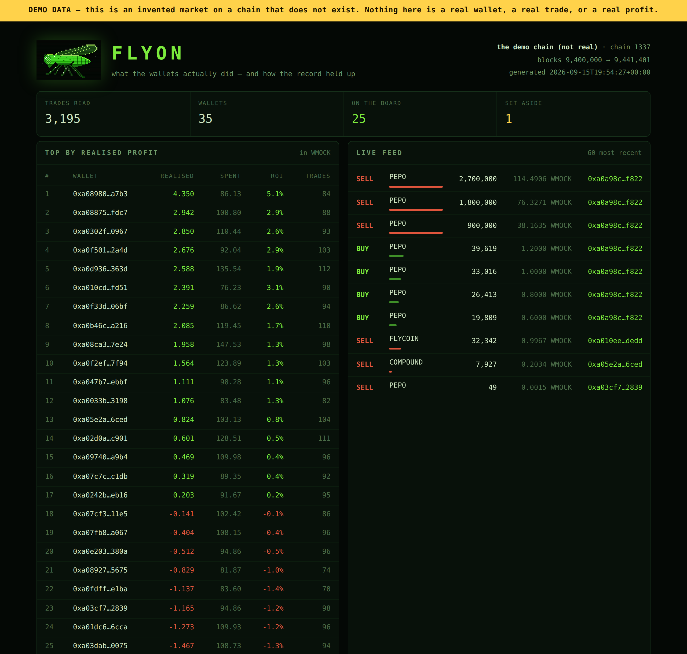

<div align="center">


# FLYON

**A wallet tracker that keeps score of its own calls.**

Reads swap logs off an EVM chain. Works out who actually made money.
Records every call the moment it is made — then publishes what happened next,
including the misses.

`python 3.10+` · `zero dependencies` · `read-only` · `MIT`

</div>

---

## Thirty seconds

```bash
git clone https://github.com/Dahka2321/FLYON && cd FLYON
pip install -e .

flyon demo          # invent a market, read it with the real indexer, build the page
open flyon-data/site/index.html
```

<div align="center">

</div>

<div align="center">
<sub>The page the code builds, photographed by <code>scripts/shot.py</code>.
The gold band is there because this run is a demo, and it cannot be removed
from the data side.</sub>
</div>

---

## Why this one is different

Every wallet tracker shows you what somebody just bought. Green for a buy, red
for a sell, a leaderboard of enormous profits, and a feeling that you are
finally seeing what the clever money does.

Almost none of them will tell you **how their own calls have actually done**,
because the honest answer is usually unflattering and nobody is obliged to
publish it.

FLYON is obliged, by construction. A call is written into an append-only,
hash-chained ledger at the block it was seen. The same code settles it later
from the same chain. There is no path through this repository that produces a
hit rate without also producing the misses.

On the demo market that ships with it, the code's own verdict on itself is:

```
500 settled  ·  hit 46%  ·  brier 0.266  ·  median -1.3%  ·  112 still open
```

Under a coin. Published anyway, on the front of the page, because a scoreboard
you can quietly leave out is not a scoreboard.

---

## What it reads

```
 chain logs ─→ swaps ─→ trades ─→ books ─→ board
                  │                 │        │
                  └─→ feed          │        └─→ calls ─→ settled ─→ score
                                    └─→ set aside
```

**Swaps, not transfers.** A `Swap` log says how much of each token moved and in
which direction. The sign is from the pool's side, so a positive amount means
the trader gave that token up — one minus sign apart from reading every buy as
a sell, which is why it is tested from both directions in both pool layouts.

**Priced in the pool's quote asset, never in dollars.** A dollar figure needs a
price feed, a price feed is somebody's API, and a leaderboard that depends on a
number nobody can re-derive is a leaderboard you have to take on faith. Quote
profit comes out of the same logs as everything else.

**First-in-first-out, closed trades only.** What a wallet still holds is shown
as a quantity and never valued.

---

## The rule that changes the board

A wallet that sells tokens this chain never saw it buy — an airdrop, a bridge,
its owner's other wallet — has no cost basis here. Counting those proceeds as
profit is how every naive tracker ends up with the same #1: somebody who moved
a bag in and dumped it.

FLYON sets that money aside, keeps the wallet off the board, and shows the
number it refused to count.

On the demo market that is **223.94 WMOCK set aside** — against a top honest
wallet on **+4.350** in the same asset. A naive board would have put the
quarantined wallet first by fifty to one.

It is not an accusation. The chain simply cannot show where those tokens came
from, and a number this tool cannot stand behind is a number it does not print.

---

## Calls, and what happened next

A call is recorded when a watched wallet buys. **It is a fact, not a forecast** —
FLYON never says a price will rise, and nothing here is advice.

What does get graded is the implied claim: that these wallets' buys are followed
by a higher price more often than a coin would be. Each call carries a
confidence *before* the outcome is known, and that confidence is not a mood — it
is that wallet's own settled hit rate so far, smoothed so two lucky calls do not
arrive at 100%.

The settlement rule is deliberately unkind to itself:

| | |
|---|---|
| exit price | the **first** trade in the same pool at or after the window closes |
| not | the best price in the window, the last one, or the nearest afterwards |
| no trade in the window | the call stays open, forever if need be |
| already settled | never settled again |

Each of those has a test that fails if someone makes it kinder. Picking among
the prices in a window is the whole game, and this code does not get to play.

Scoring is the Brier score, `(p − outcome)²` — 0 perfect, 0.25 a coin, 1 certain
and wrong — because it is the rule where your best score comes from saying what
you actually believe.

---

## The command line

```
flyon demo                     invent a market, read it, build the page
flyon index --from N --to M    read real blocks
flyon board                    top by realised profit
flyon feed                     the most recent trades
flyon score                    how the calls have actually done
flyon site                     rebuild the page from what is stored
flyon doctor                   endpoint, chain id, quote assets, ledger
```

```
$ flyon board --limit 5

  #   wallet                                       realised    spent     roi  trades
  1   0xa0c03af25caa11ed866ada02c419f86f039bf9d9     +4.350    86.13   +5.1%      84
  2   0xa0ebc3a1cc2b70f3bdc69dd10d76bef3615af1ad     +2.942   100.80   +2.9%      88
  …

  1 wallets left off: they sold tokens this chain never saw them buy.
  223.94 of proceeds set aside. flyon board --all to see them.
```

Everything lands in one folder — `./flyon-data`, or `$FLYON_HOME`:

```
trades.json     what the indexer read, so nothing is re-fetched to redraw
flyon.jsonl      the append-only record: scans, calls, settlements
site/           index.html + data.json + fly.png, ready to host anywhere
```

---

## Reading a real chain

```bash
flyon index --network robinhood --from 9400000 --to 9420000 \
           --quote 0xYOURWETH:WETH:18
```

| network | chain id |
|---|---|
| `robinhood` — Robinhood Chain | 4663 |
| `robinhood-testnet` | 46630 |

**The quote list ships empty.** Filling it with an address copied from a forum
is how a tracker ends up denominating profit in a token that is not what it
says it is, so you register what counts as money yourself and the page says
which asset every figure is in. An empty list is not a broken tracker: every
trade is still read, none is priced, and the page says so.

### It cannot spend anything

`src/flyon/rpc.py` has six JSON-RPC methods and all six read. There is no
`eth_sendRawTransaction`, no signing, no key handling, no wallet. A test parses
the file and fails if any of those words appear in it — asserting the absence of
a feature, which is the only way to promise it.

That matters more here than usual. A page that watches wallets is a page people
open with their own wallet connected, and the honest version of it should be
unable to touch anything even if it wanted to.

### When the endpoint is not reachable

```bash
flyon index --from N --to M --record run.json     # on a machine that can reach it
flyon index --replay run.json                     # anywhere, forever
```

A recorded run replays to byte-identical trades, which is also the only honest
way to show someone a number and let them re-derive it without trusting your
server.

*Not affiliated with, endorsed by, or connected to Robinhood Markets, Inc.
Robinhood Chain is read the way any public chain is read: over its public RPC,
without permission and without an account.*

---

## The demo says it is a demo

`flyon demo` invents a market — 6 pools, 35 wallets, **3,195 trades** — and
answers JSON-RPC calls about it. The real indexer then reads it the way it would
read anything: same decoding, same pool lookups, same arithmetic. There is no
shortcut from there to the numbers on the page.

Every artefact it produces is stamped. The data file carries `"demo": true`, the
network is called *the demo chain (not real)*, its explorer links point at
`example.invalid` on purpose, and the page paints a band across the top.
`site.py` **raises rather than render demo data through a template without that
band**, and a test proves it.

A demo is an honest thing. A demo that could be mistaken for live data is not.

---

## The ledger

`flyon.jsonl` — append-only, one JSON object per line, each hashed over the one
before it:

```
hash_n = sha256( seq | at | kind | body | hash_{n-1} )
```

Because the interesting claim a signals page makes is not "this wallet bought"
— it is **"we said so before it went up"**. Without an append-only record that
claim rests entirely on the author's word, and a page that can quietly insert a
winning call after the fact is indistinguishable from one that does.

**What it is not:** proof of when anything happened. Whoever holds the file can
rewrite it end to end, and a test in this repository demonstrates exactly that.
What it makes obvious is a *single* edit — one flattering confidence, one
deleted bad call — which is the thing that actually happens. The head hash is
printed in the page footer so it can be pinned somewhere you do not control.

---

## What this cannot know

- **Wash trading.** Two wallets bouncing a token between themselves can post any
  profit they like. Nothing computed from a public chain can rule that out.
- **Gas and fees.** Not in a swap log. Estimating them would be inventing a
  number, so they are not counted and the page says so.
- **Who anybody is.** FLYON ranks addresses. It does not attach names to them,
  and it will not, because a public page linking a person to a wallet is a
  different product with different consequences.
- **What a held bag is worth.** Open positions are a quantity here, never a
  valuation.
- **The future.** There is no model in this repository and no opinion. It records
  what already happened and keeps score of how that record has held up.

None of this is financial advice.

---

## Tests

```bash
python -m unittest discover -s tests -t .    # 104 tests, no network, ~5 seconds
python scripts/figures.py --check            # the README agrees with the code
```

No test opens a socket — the chain is either invented or replayed. The suite is
mostly invariants, because the failure mode that matters here is not a crash: it
is a number that is quietly, confidently wrong.

One of them exists because it caught a real bug in the first draft: a FIFO lot
whose cost drifted away from its quantity until selling dust booked a four-figure
profit out of nothing. `test_pnl.py` now pins the invariant it broke — realised
profit can never exceed what came in, and can never be worse than everything
paid.

---

## Docs

| | |
|---|---|
| [docs/PNL.md](docs/PNL.md) | how profit is computed, and everything it cannot see |
| [docs/SIGNALS.md](docs/SIGNALS.md) | calls, settlement, and every way of cheating at it |
| [docs/INDEXER.md](docs/INDEXER.md) | logs to trades, and the three things it refuses to guess |

---

<div align="center">

MIT · built for the fun of it

<sub>What the wallets actually did — and how the record held up.</sub>

</div>
